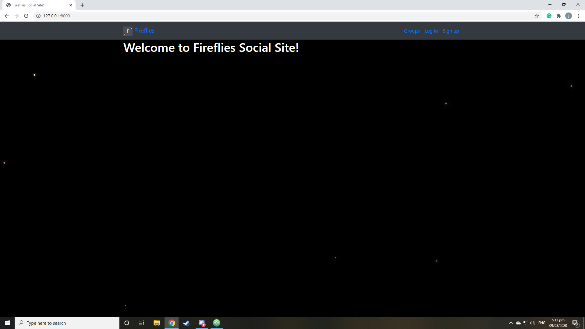

# My-Web-Applications
My List of Created Web Applications using Django

My Blog Web App live version: http://jeffrey888.pythonanywhere.com/

#### Homepage
# My Blog Web App
  

My First Blog Site using Django framework it uses Javascript, CSS and HTML elements on the website in order to look good. It also uses some backend programming for commenting in the blog and posting in the blog.

# Fireflies Social Site

#### Homepage
 

#### Grouplist
 

A social site that acts like a reddit-like site that has Groups in it and you can post in the group in it. It uses Javascript, CSS, and HTML elements on the websites also backend programming that enables the site to manage the user registration, user posts, user commenting and user sign up in the website.
